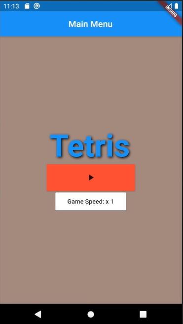
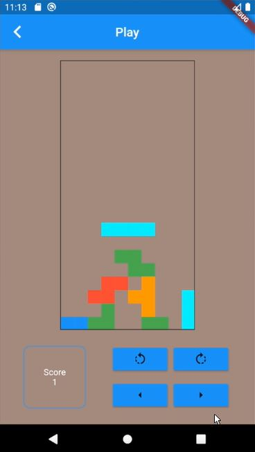

# Dart & Flutter Tetris App
 Simple Tetris app made with Dart & Flutter.

## How to use this repo
Just replace the lib folder in your dart project with the one in these folders.
Than just type 'flutter run' in your terminal (Linux) and you should be good to go.

## Prerequisites
Dart & Flutter installed on your machine.
I also recommend having Android studio installed (Virtual Machine).

## End Result
### Main Menu

### Game Screen

